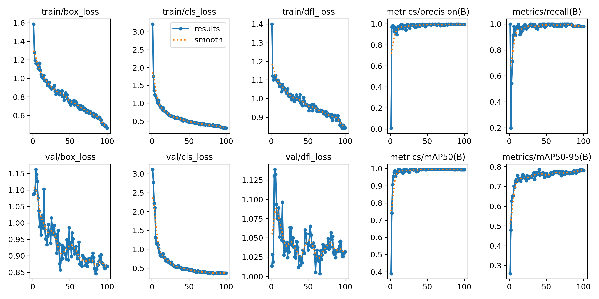
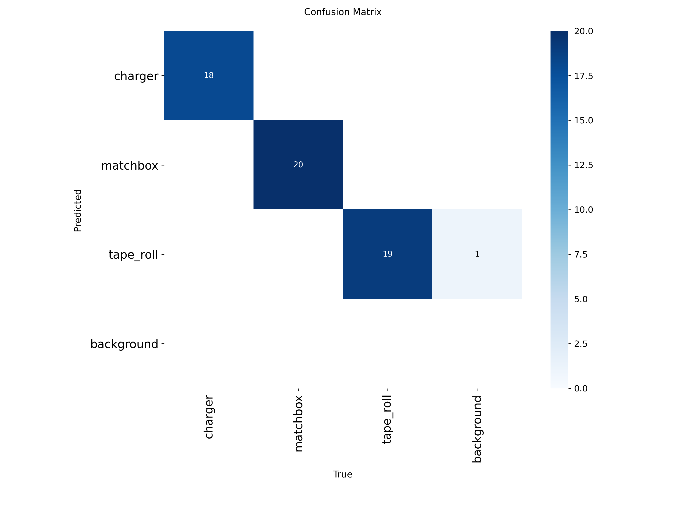
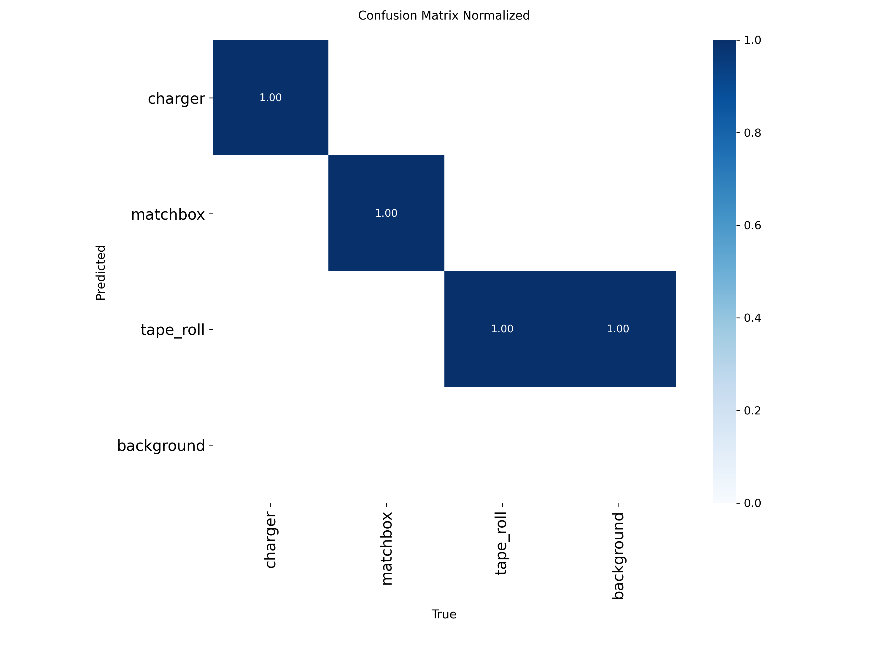
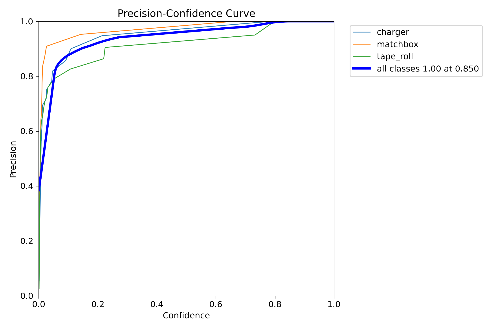
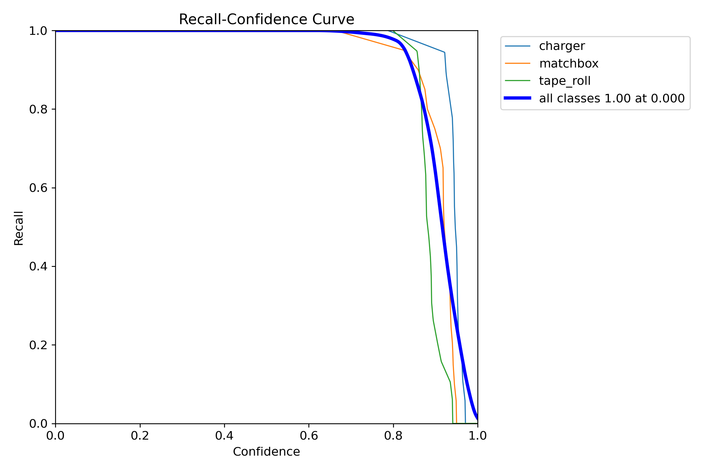
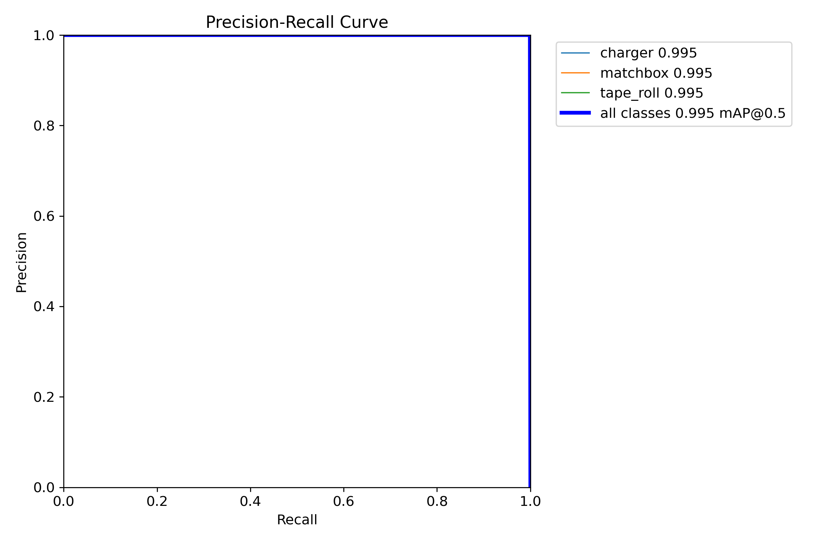
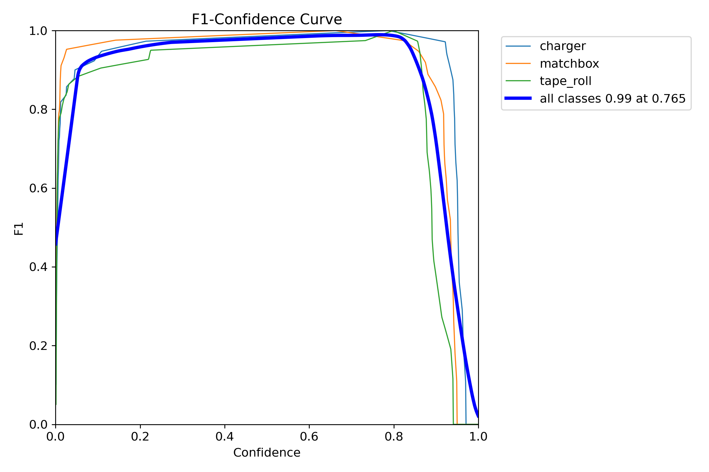

# YOLO Object Detection V1

A custom YOLOv8 object detection project developed for a Vision-Based Pick-and-Place Robotic Arm. This project detects three custom objects in real time using a webcam and serves as the vision module for a robotic arm controlled by a Raspberry Pi Zero 2 W.

---

## Project Overview

This project uses a custom-trained YOLOv8 model to detect the following objects:

- Tape Roll
- Matchbox
- Charger

The model performs real-time object detection using a webcam and will later be integrated with a robotic arm to perform autonomous pick-and-place operations.

---

## Features

- Custom YOLOv8 object detection model
- Real-time webcam detection
- Custom dataset
- GPU-accelerated training using NVIDIA RTX 3050
- Clean project structure
- Designed for future TensorFlow Lite deployment
- Ready for robotic arm integration

---

## Project Structure

```
YOLO_Object_Detection_V1/
│
├── dataset/
│   ├── train/
│   ├── valid/
│   ├── test/
│   ├── classes.txt
│   └── data.yaml
│
├── docs/
│   ├── results.png
│   ├── confusion_matrix.png
│   ├── confusion_matrix_normalized.png
│   ├── BoxF1_curve.png
│   ├── BoxP_curve.png
│   ├── BoxPR_curve.png
│   ├── BoxR_curve.png
│   └── live_detection.png
│
├── models/
│   └── object_detector_v1.pt
│
├── scripts/
│   ├── live_detection.py
│   └── split_dataset.py
│
├── README.md
├── requirements.txt
└── .gitignore
```

---

## Dataset

The custom dataset consists of three object classes:

| Class ID | Object |
|----------|---------|
| 0 | Charger |
| 1 | Matchbox |
| 2 | Tape Roll |

Images were manually collected and annotated in YOLO format.

---

## Model

- Model: YOLOv8 Nano
- Framework: Ultralytics YOLOv8
- Output Model:

```
models/object_detector_v1.pt
```

---

## Installation

Clone the repository:

```bash
git clone https://github.com/YOUR_USERNAME/YOLO_Object_Detection_V1.git
```

Move into the project folder:

```bash
cd YOLO_Object_Detection_V1
```

Create a virtual environment:

```bash
python -m venv .venv
```

Activate the virtual environment:

Windows

```bash
.\.venv\Scripts\Activate
```

Install dependencies:

```bash
pip install -r requirements.txt
```

---

## Run Live Detection

```bash
python scripts/live_detection.py
```

---

## Training

Train the custom model using:

```bash
yolo detect train model=yolov8n.pt data=dataset/data.yaml epochs=100 imgsz=640
```

---

# Training Results

## Results



---

## Confusion Matrix



---

## Normalized Confusion Matrix



---

## Precision Curve



---

## Recall Curve



---

## Precision-Recall Curve



---

## F1 Score Curve



---

## Live Detection


---

## Future Work

- Convert YOLO model to TensorFlow Lite
- Deploy on Raspberry Pi Zero 2 W
- Camera calibration
- ROI optimization
- Coordinate transformation
- Inverse kinematics
- Robotic arm integration
- Autonomous pick-and-place system

---

## Hardware Used

- NVIDIA RTX 3050 Laptop GPU
- USB Webcam
- Windows 11
- Raspberry Pi Zero 2 W (Planned)
- Pico 2 W (Planned)

---

## Software Used

- Python 3.10
- Ultralytics YOLOv8
- PyTorch
- OpenCV
- NumPy
- VS Code

---

## Author

**Devansh Upadhyay**

Vision-Based Pick-and-Place Robotic Arm Project

---

## License

This project is licensed under the MIT License.
